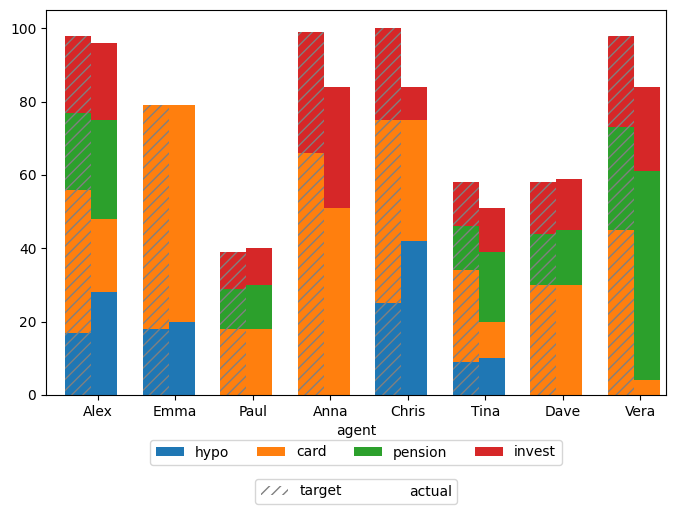

# Optimal Allocation of Call Centre Tasks

This project uses Mixed Integer Linear Programming (MILP) to allocate
campaign calls to call center agents.

To set up the environment:

- install Poetry as described in <https://python-poetry.org/docs/>
- create a virtual environment using the command `poetry install`

The input file `inputs.xlsx` specifies product and language skills of each agent,
as well as the number of available tasks for each product and language.

Run the notebook `allocate.ipynb` to explore optimization variants and results.

Allocation results are visualised using plotting functions in `utils.py`.

